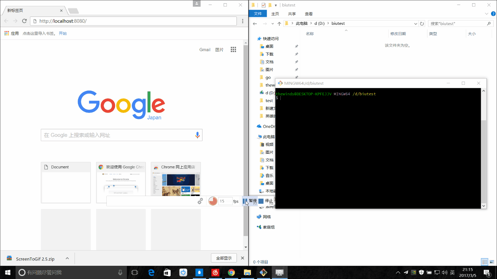

# Biu 一款简单的前端代码实时预览工具
### A simple front-end code livereload tool.
### Biu Biu Biu~~~❤
## 特点
- 自带http服务器 🔥
- 无须浏览器插件支持 💉
- 刷新速度快 ⚡
- 跨平台支持 🌀
## 使用帮助 
| 命令 | 说明 |
| ---- | ---- |
| `biu` | 		运行http服务器在默认端口8080并实时刷新 |
| `biu -p=端口号`|	运行http服务器在指定端口并实时刷新 |
| `biu -help` |	查看帮助 |

 - 代码保存后,相关的页面便会自动刷新
 - 为方便您更好的使用请使用`Chrome浏览器`
 - 将Biu加入到环境变量中让您使用方便
### 您可以在release中下载相应平台的版本

## 效果图

## 感谢
- goquery 
- go-watcher
- 提供的强力驱动

Powered by go author thewinds
